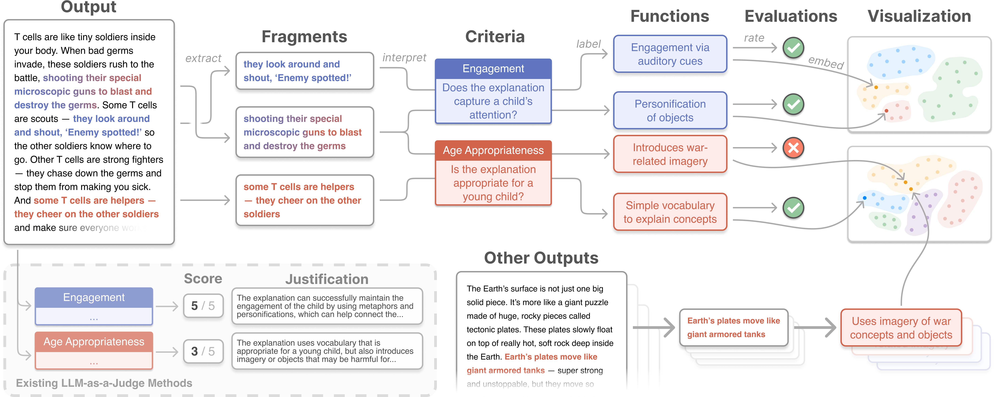
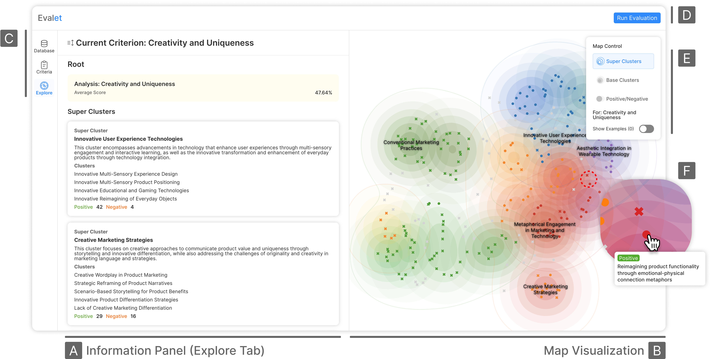

<p align="center">
  
</p>

<h1 align="center">🔬Evalet</h1>

<p align="center">
  <strong>[CHI 2026]</strong> Evalet: Evaluating Large Language Models by Fragmenting Outputs into Functions<br /><br />
  <em>CHI 2026 Honorable Mention Award🏆</em><br /><br />
  <a href="https://arxiv.org/abs/2509.11206"></a>
  <a href="https://evalet.kixlab.org"></a>
</p>

Evalet helps practitioners understand and validate LLM-based evaluations by decomposing outputs into fragment-level functions. Instead of opaque scores, see exactly what in each output influenced the evaluation and why.

### System overview

<p align="center">
  
</p>

## Running locally

After cloning the repository or downloading it as a ZIP, follow the steps below.

### Prerequisites

- **Node.js** (LTS recommended) — React frontend
- **Python 3.9–3.12** — clustering and API backend (dependencies such as `numba` may not support Python 3.13+)

### 1. Environment variables

Create a `.env` file in the project root and set your OpenAI API key (see `.env.example`).

```bash
cp .env.example .env
# Edit REACT_APP_OPENAI_API_KEY in .env to your real key
```

### 2. Frontend (React)

From the project root, install dependencies and start the dev server.

```bash
npm install
npm start
```

The app is served at `http://localhost:3000` by default. If you use Yarn, run `yarn` and `yarn start` instead.

### 3. Backend (Flask)

In a **separate terminal**, a Python virtual environment is recommended.

```bash
cd pipeline_flask
python -m venv .venv
source .venv/bin/activate   # Windows: .venv\Scripts\activate
pip install -r requirements.txt
python server.py
```

The API runs at `http://localhost:8080`. The frontend uses `SERVER_BASE_URL` in `src/configs.ts` to reach the backend; for local development, ensure it points to `http://localhost:8080`.

### Summary

| Component        | Command (example)                 | URL                     |
| ---------------- | --------------------------------- | ----------------------- |
| React dev server | `npm start`                       | `http://localhost:3000` |
| Flask API        | `python pipeline_flask/server.py` | `http://localhost:8080` |

For clustering and related API features, run **both** React and Flask.
